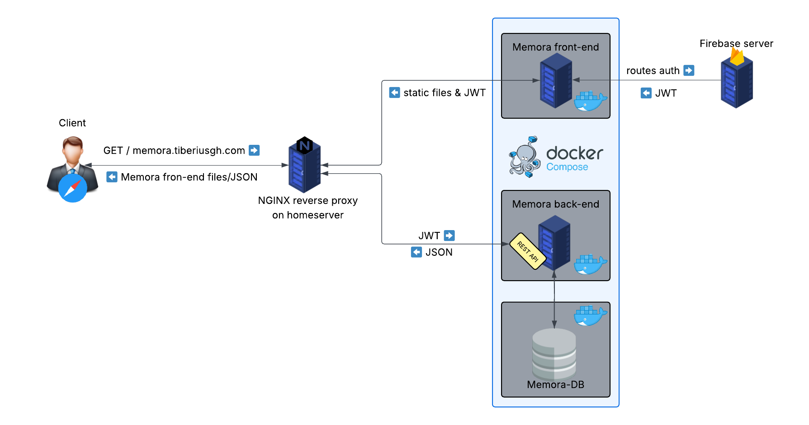

# memora_back_end



## Nginx setup instructions (for production)

nginx acts as a **traffic director** - it receives all requests and decides where to send them:

- **API requests** (`/api/*`) → Backend server
- **Everything else** → Frontend files

### Add This Configuration:

- This configuration assumes default container ports (5173 for frontend, 8186 for backend)

```nginx
server {
    listen 80;
    server_name your-domain.com; # Replace with your domain

    # Route API requests to backend container
    location /api/ {
        proxy_pass http://localhost:8186/api/;
        proxy_set_header Host $host;
        proxy_set_header X-Real-IP $remote_addr;
    }

    # Route all other requests to frontend container
    location / {
        proxy_pass http://localhost:5173;
        proxy_set_header Host $host;
        proxy_set_header X-Real-IP $remote_addr;

        # Support for live reloading (if needed)
        proxy_http_version 1.1;
        proxy_set_header Upgrade $http_upgrade;
        proxy_set_header Connection "upgrade";
    }
}
```
